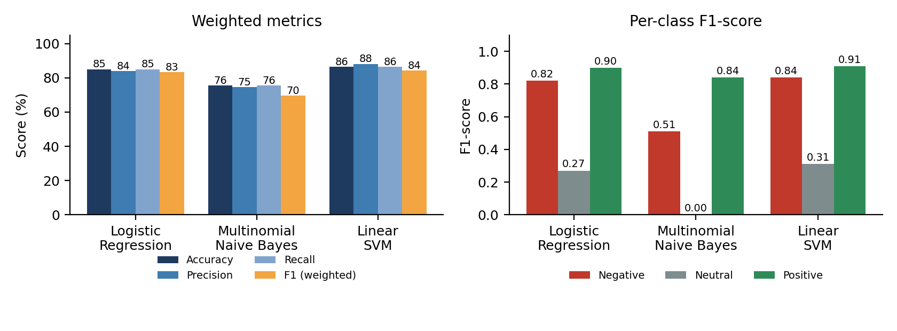
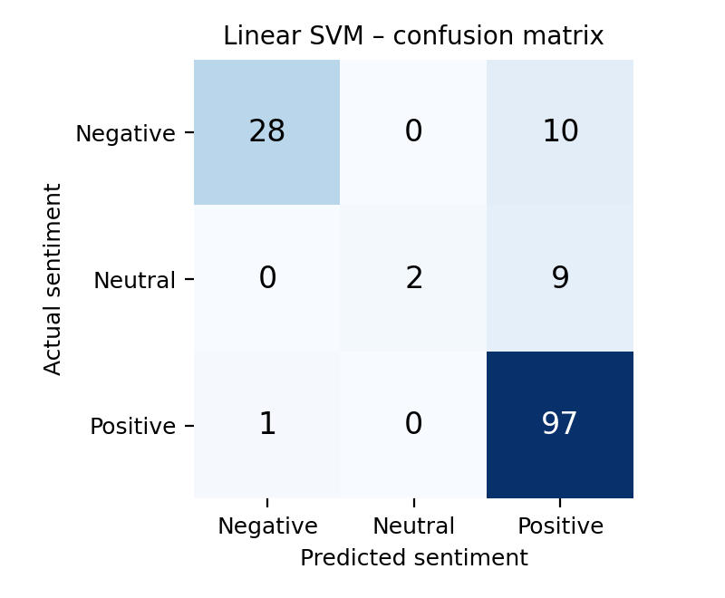
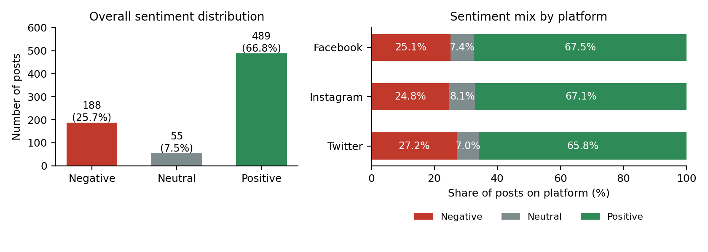
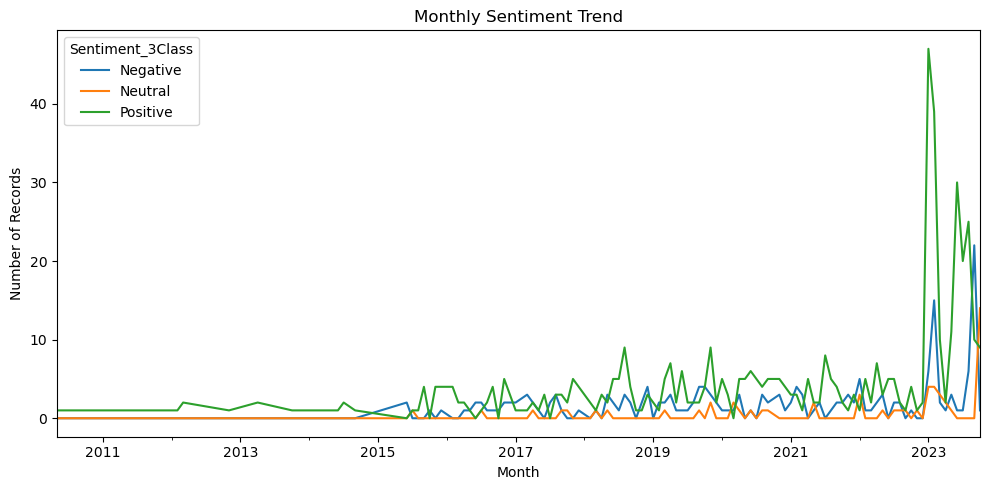

# Social Media Sentiment Analysis Using NLP and Machine Learning

**United International University – School of Business and Economics**
**Course project: Real-Life Project – NLP & Sentiment Analysis**

**Author:** YOUR NAME | **Student ID:** YOUR ID | **Group:** YOUR GROUP

## Project Summary

This project builds an end-to-end Natural Language Processing (NLP) pipeline that classifies social media posts as **Positive, Negative or Neutral**. Raw text from 732 Facebook, Instagram and Twitter posts is cleaned, converted into TF-IDF features (unigrams and bigrams) and used to train three classifiers: Logistic Regression, Multinomial Naive Bayes and Linear SVM. The models are compared on a held-out test set, and **Linear SVM performed best with 86.39% accuracy and 84.34% weighted F1-score**. The project also analyses sentiment by platform and over time, and discusses the main weakness of the model: the small Neutral class.

## Repository Structure

```
.
├── README.md
├── requirements.txt
├── data/
│   └── SocialMediasentimentdataset.csv
├── notebooks/
│   └── Social_Media_Sentiment_Analysis_Using_NLP.ipynb
├── outputs/
│   ├── model_comparison.png
│   ├── sentiment_distribution_platform.png
│   ├── confusion_matrix_svm.png
│   └── monthly_sentiment_trend.png
└── report/
    └── Sentiment_Analysis_Project_Report.docx
```

> Adjust this tree so it matches the folders in your repository.

## Dataset

The dataset (`SocialMediasentimentdataset.csv`) contains **732 social media posts** with 15 columns, including `Text`, `Sentiment`, `Timestamp`, `User`, `Platform`, `Hashtags`, `Retweets`, `Likes`, `Country`, `Year`, `Month`, `Day` and `Hour`. There are no missing values and no duplicate rows.

The original `Sentiment` column contains **191 different emotion labels** (for example Joy, Anger, Nostalgia, Confusion) instead of direct Positive/Negative/Neutral labels. These were mapped into three classes by general polarity and stored in a new column, `Sentiment_3Class`, which is the prediction target. Because the mapping was done by hand rather than by human annotators, some labels are subjective.

| Sentiment | Count | Percentage |
| --------- | ----: | ---------: |
| Positive  |   489 |     66.80% |
| Negative  |   188 |     25.68% |
| Neutral   |    55 |      7.51% |

## Method

1. **Label mapping:** 191 emotion labels grouped into Positive, Negative and Neutral.
2. **Text preprocessing:** lowercasing, removal of URLs, @mentions, punctuation and numbers, tokenisation by word splitting, and English stopword removal (`Clean_Text` column).
3. **Train/test split:** 80:20 stratified split (585 training posts, 147 test posts, `random_state=42`).
4. **Feature extraction:** TF-IDF with `max_features=5000` and `ngram_range=(1, 2)`.
5. **Models:** Logistic Regression (balanced class weights), Multinomial Naive Bayes, and Linear SVM (balanced class weights).
6. **Evaluation:** accuracy, precision, recall and weighted F1-score, plus a confusion matrix for the best model.

## How to Install and Run

**Requirements:** Python 3.9 or newer.

```bash
# 1. Clone the repository
git clone https://github.com/smmehedidm/Social_Media_Sentiment_Analysis_-using_NLP_and_Machine_Learning.git
cd Social_Media_Sentiment_Analysis_-using_NLP_and_Machine_Learning

# 2. (Optional) create a virtual environment
python -m venv venv
source venv/bin/activate        # Windows: venv\Scripts\activate

# 3. Install dependencies
pip install -r requirements.txt

# 4. Start Jupyter and open the notebook
jupyter notebook notebooks/Social_Media_Sentiment_Analysis_Using_NLP.ipynb
```

Then choose **Kernel → Restart & Run All**. The notebook downloads the NLTK `punkt` and `stopwords` data automatically on the first run.

> The notebook loads the dataset with `pd.read_csv("SocialMediasentimentdataset.csv")`. If you keep the file in the `data/` folder, change that line to `pd.read_csv("../data/SocialMediasentimentdataset.csv")`.

## Key Results

Evaluation on the 147-post test set:

| Model                   |   Accuracy |  Precision |     Recall | Weighted F1 |
| ----------------------- | ---------: | ---------: | ---------: | ----------: |
| Logistic Regression     |     85.03% |     83.92% |     85.03% |      83.32% |
| Multinomial Naive Bayes |     75.51% |     74.61% |     75.51% |      69.50% |
| **Linear SVM**          | **86.39%** | **88.19%** | **86.39%** |  **84.34%** |



**Confusion matrix (Linear SVM)**

| Actual / Predicted | Negative | Neutral | Positive |
| ------------------ | -------: | ------: | -------: |
| Negative           |       28 |       0 |       10 |
| Neutral            |        0 |       2 |        9 |
| Positive           |        1 |       0 |       97 |



**Main findings**

- Linear SVM was the best model and was selected as the final model. The gap to Logistic Regression is small (127 vs 125 correct test posts), so cross-validation would be needed to separate them with confidence.
- The Positive class is classified very well (97 of 98 correct), and Negative reasonably well (28 of 38).
- The **Neutral class is the weakest** (only 2 of 11 correct; 9 were predicted as Positive), mainly because it is small and its posts share little distinctive wording.
- Positive sentiment is the largest class on all three platforms, and the sentiment mix is similar across Facebook, Instagram and Twitter (Twitter is slightly more negative).
- **September 2023** is a notable month: Negative posts (22) outnumbered Positive posts (10).





## Limitations

- The three-class target is derived from 191 emotion labels, not annotated directly, so some label noise is likely.
- The dataset is imbalanced, and the Neutral test set has only 11 posts, so Neutral results are unstable.
- Most posts fall in 2023; many earlier months contain very few records.
- TF-IDF ignores word order and context, so sarcasm and negation are hard for the model to handle.

## Future Improvements

- Relabel and collect more Neutral examples.
- Use stratified k-fold cross-validation and hyperparameter tuning (for example the SVM's `C` value).
- Fine-tune a pretrained transformer model such as BERT to capture context.

## Business Implication

The model is useful as a **first-pass screening tool** for monitoring social media at scale: when it flags a post as Negative it is correct 97% of the time. However, it misses about a quarter of Negative posts and most Neutral posts, so it should support human review rather than replace it, and it is best used to monitor sentiment trends over time.

## Tools Used

Python, pandas, NumPy, scikit-learn, NLTK, matplotlib, seaborn, Jupyter Notebook.
